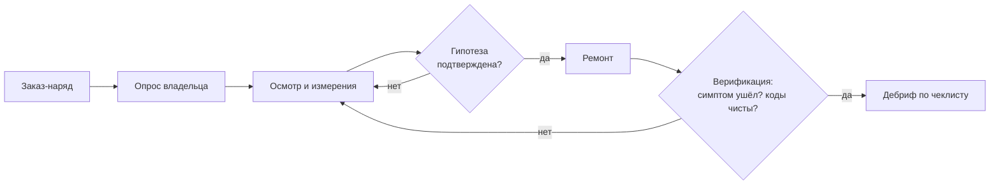

# 03. Механики

## Игровой цикл дела



Цикл повторяется внутри рабочего дня. День = 480 минут; Марина выдаёт 2–4 заказа,
клиент каждого ждёт в своей очереди (для некоторых архетипов ожидание критично).

## Ресурсы

| Ресурс | Модель | Что происходит при нуле |
|---|---|---|
| **Время** | минуты внутри дня; у дела свой бюджет | просрочка: −10 репутации, клиент может уйти |
| **Деньги** | заработок (час × 1500 + прайс работ) минус детали, инструменты, аренда | отрицательный баланс: нельзя покупать детали — только ремонтировать проводку |
| **Репутация** | 0–100, старт 50 | ниже 20: поток заказов скуднеет, сюжетный ультиматум акта 3 |
| **Заряд АКБ машины** | у каждой машины свой SoC; тесты под нагрузкой его тратят | АКБ сел посреди диагностики: подзарядка 60 минут — реальная цена небрежности |

Заряд АКБ — фирменная механика: диагностические действия вроде «прокрутить стартёром»,
«погонять на стенде», «ночная запись утечки» расходуют батарею. Игрок учится планировать
измерения, чтобы не посадить аккумулятор клиента.

## Действия и стоимость

Все цены — в минутах игрового времени (единый источник значений):

**Информация**

| Действие | Мин | Примечание |
|---|---|---|
| Вопрос владельцу | 5 | максимум 8 вопросов, дальше клиент раздражается |
| Осмотр зоны | 10 | видимые дефекты: окислы, перетиры, влага, следы чужого ремонта |
| Открыть схему | 5 | карта цепи; для multi-system обязательна |
| Поиск компонента на схеме | 5 | уточняет номера предохранителей/разъёмов |

**Измерения**

| Действие | Мин | Ограничение |
|---|---|---|
| Подключение к новой зоне | +10 | разовая подготовка зоны |
| Мультиметр: напряжение | 15 | честные значения только под нагрузкой |
| Мультиметр: сопротивление/прозвонка | 15 | только на обесточенной цепи, иначе ошибка измерения |
| Токовые клещи / замер утечки | 20 (+10 подготовка режима сна) | машина должна «уснуть» |
| Сканер: коды всех модулей | 20 | Active/Stored/Pending отдельно |
| Сканер: live data | 15 | выбор до 4 параметров |
| Сканер: Freeze Frame | 5 | снимок условий ошибки |
| Сканер: стирание кодов | 10 | часть верификации |
| Осциллограф | 30 | форма сигналов CAN/датчиков |

**Воздействия**

| Действие | Мин | Эффект |
|---|---|---|
| Снять/вернуть предохранитель №N | 10 | изоляция цепи |
| Отключить устройство/разъём | 10 | изоляция узла |
| Стенд условий: холод/влага/вибрация | 20 | воспроизведение intermittent |
| Встряхивание жгута / простукивание | 10 | только при активном симптоме или стенде |
| Термоспрей / тепловая пушка | 15 | ловля температурных дефектов |
| Чистка контакта/массы | 20 | ремонтная операция |
| Ремонт проводки (пайка, гофра) | 40 | устраняет обрыв/КЗ |
| Замена детали | 60 + цена детали | см. «Пушка запчастей» |
| Подзарядка АКБ машины | 60 | после разряда |
| Контрольная проверка (верификация) | 20 | обязательна для закрытия дела |
| Фотофиксация шага | 5 | бонус к очкам метода, протокол страховой в акте 4 |

## Опрос владельца

Вопросы трёх категорий: **симптомы**, **условия**, **история**.
Хороший вопрос («после мойки?», «только на холоде?») открывает *условия воспроизведения* —
без них intermittent-дела практически не решаются, поскольку стенду нужно знать, что воспроизводить.
Плохие вопросы («а вы точно заливаете хороший бензин?») тратят лимит и терпение клиента.
Архетип клиента меняет информативность ответов (см. 02) — бабушка рассказывает всё,
перекуп лжёт, пока глубокий осмотр не вскроет правду.

## Модель измерений

- Цепь — граф узлов (АКБ → предохранитель → реле → разъём → потребитель → масса).
- Каждый узел хранит истинные значения: напряжение покоя/под нагрузкой, сопротивление
  до массы, целостность, состояние контакта.
- Условия среды (влажность, температура, вибрация) — модификаторы модели: мокрый разъём
  меняет утечки, холодный датчик меняет сигнал.
- Инструмент читает модель честно: мультиметр покажет 12.6 В покоя даже там, где под нагрузкой
  будет 9.8 В — игра специально учит мерить под нагрузкой, а сопротивление на живой цепи
  фиксирует как «ошибку измерения» с подсказкой журнала.

## Гипотезы и доска улик

Игрок ведёт рабочую гипотезу: выбирает предполагаемую причину из списка открытых типов
(см. 05) и привязывает улики-подтверждения (конкретные измерения). Гипотеза без подтверждённой
улики считается «слепой»: кнопка «заменить деталь» при слепой гипотезе доступна, но помечена красным.
Это мягкий способ заставить проговаривать доказательства — ядро научного метода.

## Пушка запчастей

Замена детали при неподтверждённой причине:

1. если причина была именно эта — редкая удача, дело закрыто, но очки метода низкие;
2. если нет — деньги потрачены, симптом остался, −5 репутации;
3. три слепые замены в одном деле — клиент уезжает, дело провалено.

Отдельное правило (страница журнала №7): **«ЭБУ не меняют до проверки проводки»** —
попытка заменить блок управления до проверки его питания и массы блокируется
с первой репликой дяди Славы; повторная попытка в том же деле разрешена, но штраф удваивается.

## Верификация

Закрыть дело можно только контрольной проверкой: воспроизвести исходные условия
(стенд), убедиться, что симптом ушёл, стереть коды, сделать контрольный запуск.
Ремонт без верификации засчитывается как незавершённый: оплата половинная, риск возврата
в следующий день (машина вернётся с тем же симптомом, репутация −10).

## Подсчёт очков дела

```
Очки = 1000 × K_метод × K_время − Штрафы
K_метод  = покрытие чеклиста алгоритма: 0.5 … 1.3
K_время  = бюджет / фактически потрачено: 0.6 … 1.2 (кап)
Штрафы:
  −300  слепая замена детали (мимо причины)
  −200  закрытие без верификации
  −100  разряженный в работе АКБ
  −500  нарушение ограничения гарантии/протокола (архетип Ольги, акт 4)
  +100  полная фотофиксация ключевых шагов
```

Очки конвертируются в оплату и опыт ступени; статистика метода (доля дел без слепых замен)
определяет концовку.

## Дебриф

После каждого дела — сверка с чеклистом соответствующего алгоритма:

- таблица «шаг → сделан / пропущен»;
- самая дешёвая траектория: где можно было найти причину дешевле;
- карточка правила модуля 20, которое иллюстрирует главный промах;
- рекомендация следующего дела (закрывает пробел адаптивной системой).

Пример строки дебрифа: «Массу фары можно было проверить прозвонкой за 15 минут —
до замены фары за 60 минут и 4200 ₽».

## Адаптивность

- Пропущенные шаги превращаются в **мини-тренажёры** (5 минут реального времени):
  «прочитай показание мультиметра — норма или падение?» — вставляются перед следующим делом.
- Частота подсказок дяди Славы обратно пропорциональна точности игрока на ступени.
- Если игрок три дела подряд закрывает вслепую — сюжетно приходит клиент Толика,
  чья машина напичкана чужими деталями: наглядный урок последствий.

## Особые режимы

| Режим | Условия | Чему учит |
|---|---|---|
| Ночной вызов | лимит фонаря и заряда АКБ, очередь одна машина | приоритизация измерений при жёстком ресурсе |
| Выезд | багажник вмещает 4 инструмента на выбор | планирование комплекта до встречи с задачей |
| Экзамен (акт 5) | таймер, журнал недоступен, протокол действий | самостоятельность: алгоритм должен быть в голове |
| Свободный гараж | бесконечная генерация дел выбранной ступени | практика после прохождения |

## Провал

Game over отсутствует. Проваленное дело — это потерянные деньги, репутация и сюжетная нота Марины.
Только репутация ниже 20 запускает сюжетную угрозу аренды (акт 3): вернуть её можно серией успешных
дел, но цена ошибки уже ощутима.
